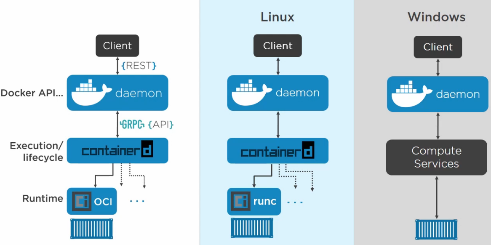
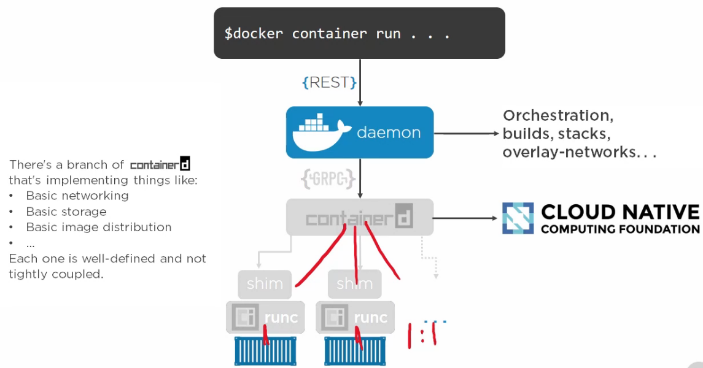

## Installing Docker

```bash
wget -qO- https://get.docker.com/ | sh
```

adding your user to the "docker" group:

```bash
sudo usermod -aG docker <your-user-name>
```

## Architecture and Theory

Operating System, Container, Isolation, Control Groups, Namespaces

### Kernel primitives

- [Control Groups](https://en.wikipedia.org/wiki/Cgroups) (C Groups / in Windows Job Objects): grouping objects and setting limit
- [Namespaces](https://en.wikipedia.org/wiki/Linux_namespaces): isolation.
- Container
  - Process ID (pid)
  - Network (net)
  - Filesystem/mount (mnt)
  - Inter-proc comms (ipc)
  - UTS (uts)
  - User (user)

### Docker Engine

CLI -> API -> daemon -> containerd -> OCI




### DE for windows

there are two types of windows containers
| Attempt | Native windows containers | Hyper-V Containers |
| :---: | :---: | :---: |
| os tech | Namespace isolation | VM, but less performance than a full blown VM |
| kernel/os | Uses hosts kurnel | not using the host's karnet, have own OS |
| linux | can't have linux here | as it can have it's own karnel and OS, so we can have linux here |
| run | docker container run .. | docker container run --isolation=hyperv |

## Working with Images

### Docker images

|                        Image                        |    Container    |
| :-------------------------------------------------: | :-------------: |
| read only template to create application containers | a running image |
|                     build time                      |    run time     |
|                                                     |                 |
|                                                     |                 |
|                                                     |                 |

Image: a bunch of independent layer that are very loosely connected through manifest file (or config file).

#### [Manifest file](https://docs.docker.com/engine/reference/commandline/manifest/)

to play with the manifest command, you need to enable docker experimental feature on your machine. You can get help from [this link](https://docs.docker.com/engine/reference/commandline/cli/#experimental-features).

1. create a file in .docker/config.json
2. paste the following code into the file:

```json
{
  "experimental": "enabled",
  "debug": true
}
```

3. do want to now more about a manifest file? run the following command

```bash
docker manifest inspect <imagename>
```

4. what does `docker pull <imagename>` command do?

   1. get the manifest file
      1. Fat Manifest: list architecture supported and and a manifest for all of those. first it get the fat manifest to match with my system architecture config match.
      2. Image Manifest: the actual manifest for my machine. Then it get the manifest that machaes my machine architecture.
   2. Pull layers

5. [Content addressable storage](https://docs.docker.com/registry/compatibility/#content-addressable-storage-cas)

   ```bash
   docker image ls --digests
   ```

6. To see the docker system info:
   ```bash
   docker system info
   ```
7. The file system inside a container will be the base layer file system, not the host machine's file system.

8. do you want to see the layer history of an docker image?

   ```bash
   docker history <imagename>
   ```

9. do you want to know the details of a docker image?

   ```bash
   docker image inspect <imagename>
   ```

10. and finally you may want to free up space by deleting any unused image?
    ```bash
    docker image rm <imagename>
    ```

### Registries

Images line in regitries. Within the registries we have repos. Within repos, we have images or tags.
`registry/repo/image(tag)`
Along with many public registries other than docker hub, we can have our own private docker registry.

repo:latest

> latest tagged repo: does nto alway means that it is the later version of the repo. To make a repo latest, we have to explicitely mention while creating the image.

mehdihasan/pokemon

> you may need to add name of the user or the organization while dealing with a repo because they are not official version of any image.

distribution hash / cotent hash

#### Best practices

1. using official images
2. keep the images small
3. explicitely reference of the image version, not just only latest.

## Containerizing an App

### Discussion

Dockerfile: where developers describe their apps and how they work, and for ops to read the file and understand.

### Containerize an App

- Instructions for building images
- CAPITALIZE instructions
- <'INSTRUCTION'> <'value'>
- FROM = base image
- Good practice to list maintainer
- RUN = execute command and create layer
- COPY = copy code into image as new layer
- Some instructions add metadada instead of layers
- ENTRYPOINT = default app for image/container

### Dig Deeper

### Multi-stage Builds
